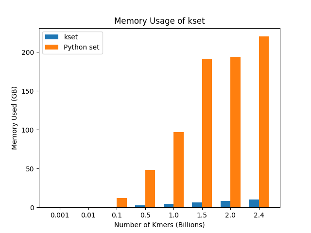

# kcollections

[](https://github.com/masakistan/kcollections/actions/workflows/ci.yml)

**In-memory Python k-mer sets, dicts, and counters that use far less RAM than built-in `set`/`dict`.**

Built for **research prototyping** and **light production** pipelines where you want normal Python APIs and can keep indexes in RAM. For billion-scale on-disk indexes, use [KMC](https://github.com/KmerTools/KMC) or Jellyfish instead — see [docs/USAGE.md](docs/USAGE.md).

## Install

```bash
# macOS
brew install cmake
pip install kcollections

# Linux (Debian/Ubuntu)
sudo apt-get install -y cmake build-essential
pip install kcollections
```

From source: `pip install .` · Dev: `pip install -e ".[dev]"`

Requires **Python 3.10+**, **CMake 3.18+**, **C++17** (no Boost).

## Quick start

```python
from kcollections import Kset, Kdict, Kcounter

# Unique k-mers
ks = Kset(27)
ks.add_seq("AAACTGTCTTCCTTTATTTGTTCAGGGATCGTGTCAGTA")
ks.save("index.kc")
ks2 = Kset.from_file("index.kc")

# K-mer → value
kd = Kdict(int, 27)
kd["AAACTGTCTTCCTTTATTTGTTCAGGG"] = 1

# Abundance
kc = Kcounter(27)
kc.add_seq("AAACTGTCTTCAAACTGTCTTT")
print(kc.most_common(5))
```

More examples: [`examples/`](examples/) · Full guide: [`docs/USAGE.md`](docs/USAGE.md) · Upgrading: [`MIGRATION.md`](MIGRATION.md)

**Conda:** recipe in [`conda-recipe/`](conda-recipe/) · **Releases:** [`RELEASE.md`](RELEASE.md) (tag → PyPI + GitHub release).

## Parallel bulk insert

```python
ks = Kset(27)
ks.parallel_add_init(16)   # thread count: power of 2
ks.parallel_add_seq(dna)
ks.parallel_add_join()
```

## What to use when

| Task | Tool |
|------|------|
| Python research, typed k-mer metadata | **kcollections** |
| RAM-heavy but &lt; ~100M k-mers | built-in `set` may suffice |
| Huge on-disk k-mer DB | KMC, Jellyfish, Cuttlefish |
| MinHash / sketching | sourmash |

## Persistence (production)

- Prefer **`save()` / `load()`** or **`Kset.from_file(path)`**.
- Pin the package version; binary indexes use **`kcollections-v2`** (see [MIGRATION.md](MIGRATION.md)). Re-save indexes when upgrading major versions.

## Tests

```bash
pip install -e ".[dev]"
pytest tests -q
```

## Performance

Memory-efficient vs Python `set` for large k-mer sets (27-mers, human genome — see figures in repo). Insertion is slower than `set`; memory is the tradeoff this library optimizes.



## Citation

Bloom Filter Trie extension and library: Fujimoto & Lyman; also cite [Holley et al., Bloom Filter Trie](https://github.com/GuillaumeHolley/BloomFilterTrie).

## License

GPLv3 — see [LICENSE](LICENSE).
