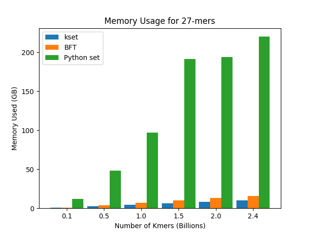

# kcollections
[](https://travis-ci.com/masakistan/kcollections)

A fast and efficient library for storing k-mers in python.

## About
`kcollections` is a python-like `dict` and `set` that efficiently store kmers as keys or elements of the collection.
It is designed for building/prototyping Bioinformatics tools that rely on kmers but where the included `dict` and `set` consume too much memory for use.

It implements the [Bloom Filter Trie](https://github.com/GuillaumeHolley/BloomFilterTrie) algorithm.
This implementation differs from Guillaume et al. by allowing kmers of arbitrary size and by providing a generic dictionary/map data structure for associating arbitrary values with kmers.

`kcollections` is currently only available for Python version 2.7.

## Installation
We provide some pre-compiled binaries for python 2/3 and Linux and MacOS:

```bash
pip install kcollections
```

Alternatively, you can build from source.

### Build from source
Prerequisites include:

  - [CMake](https://cmake.org/), must be installed manually in order to build the code.
  - [uint256_t](https://github.com/calccrypto/uint256_t), included in the repository.
  - [pybind11](https://github.com/pybind/pybind11), included in the repository.

To build and install the python module from source:

```bash
git clone https://github.com/masakistan/kcollections.git
cd kcollections

# python 3
python3 setup.py install
# or
pip3 install .

# python 2
python2 setup.py install
# or
pip2 install .
```

Additionally, if you would like to access the functions from a C++ program, you can build static libraries with the following steps:

``` bash
git clone https://github.com/masakistan/kcollections.git
cd kcollections

mkdir build
cd build

cmake ..
make
```

## Example Usage

### Using Kset

#### Serial Insertion
Kmers can be added one at a time with `add`, but the fastest way to add kmers to a set is
to add a DNA sequence using `add_seq`.

```python
import kcollections
ks = kcollections.Kset(27)

# add single kmer
ks.add('AAACTGTCTTCCTTTATTTGTTCAGGG')

# sequence insertion
seq = 'AAACTGTCTTCCTTTATTTGTTCAGGGATCGTGTCAGTA'
ks.add_seq(seq, len(seq))

assert 'AAACTGTCTTCCTTTATTTGTTCAGGG' in ks
# iteration
for kmer in ks:
    print kmer
```

#### Parallel Insertion
The fastest way to use `Kset` is to use multithreaded insertion.
Multithreaded approach is best used when all kmers are loaded upfront.
Kmers not accessible until the threads have been joined using
`parallel_add_join`.
See the example below on how parallel and serial insertions can be used.

```python
import kcollections
ks = kcollections.Kset(27)

# multithreaded sequence insertion
# nthreads must be a power of 2.
# nthreads = 4 or 16 work well
ks.parallel_add_init(16)

# insert a sequence of kmers
ks.parallel_add_seq(seq)

# insert a single kmer
ks.parallel_add('AAACTGTCTTCCTTTATTTGTTCACAG')

# merge threads together
# no parallel add methods can be used after joining
ks.parallel_add_join()

# serial add is permissible after threads have joined
ks.add('AAACTGTCTTCCTTTATTTGTTCACAG')

# iteration
for kmer in ks:
    print(kmer)
print len(ks)
```

### Using Kdict

#### Serial Insertion
```python
import kcollections
kd = kcollections.Kdict(27)

# insertion and value assignment
kd['AAACTGTCTTCCTTTATTTGTTCAGGG'] = 'banana'
kd['AAACTGTCTTCCTTTATTTGTTCAGGT'] = 'phone'
assert kd['AAACTGTCTTCCTTTATTTGTTCAGGG'] == 'banana'
assert kd['AAACTGTCTTCCTTTATTTGTTCAGGT'] == 'phone'

# iteration
for kmer, val in kd.items():
    print(kmer, val)

# removal
del kd['AAACTGTCTTCCTTTATTTGTTCAGGT']
```

#### Parallel Insertion
Parallel insertion for `Kdict` requires the inclusion of a merging function to resolve different values for the same key.
The following snippet adds 27mers from a string of DNA using a provided lambda function to merge value conflicts.
This merge function simply keeps the newest value associated with the kmer.
More examples of merging functions with `Kdict` can be found [here](kdict_merging.md).

```python
kd = kcollections.Kdict(27)
kd.parallel_add_init(4)
kd.set_merge_func(lambda prev_val, new_val: new_val)
kd.parallel_add_seq(dna, generate_idx(len(dna)))
kd.parallel_add_join()
```

### Using Kcounter

`Kcounter` is an implementation of the Python collection's
[Counter](https://docs.python.org/2/library/collections.html#collections.Counter),
but the keys must be kmers, of course!
Like `Kdict`, kmers can be added to `Kcounter` one at a time, but the
fastest ways to add kmers to a set is to add an DNA sequence using `add_seq` (or
`parallel_add_seq` for multithreaded inserts).

#### Serial Insertion
```python
from kcollections import Kcounter
kc = Kcounter(27)

# add single kmer
kc['AAACTGTCTTCCTTTATTTGTTCAGGG'] += 1

# sequence insertion
seq = 'AAACTGTCTTCCTTTATTTGTTCAGGGATCGTGTCAGTA'
kc.add_seq(seq)

assert kc['AAACTGTCTTCCTTTATTTGTTCAGGG'] == 2

# iteration
for kmer, count in kc.items():
    print(kmer, count)
```

#### Parallel Insertion

```python
from kcollections import Kcounter
kc = Kcounter(27)

# multithreaded sequence insertion
# nthreads must be a power of 2.
# nthreads = 4 or 16 work well
kc.parallel_add_init(16)

# insert a sequence of kmers
kc.parallel_add_seq(seq)

# insert a single kmer
kc.parallel_add('AAACTGTCTTCCTTTATTTGTTCACAG')

# merge threads together
# no parallel add methods can be used after joining
kc.parallel_add_join()

# updates can be made after the join
kc['AAACTGTCTTCCTTTATTTGTTCAGGG'] += 1

# iteration
for kmer, count in kc.items():
    print(kmer, count)
```

## Performance
`kcollections` is quite a bit slower than the `dict` or `set` but is much more memory-efficient.
We measured memory usage and running time using `/usr/bin/time -v` on a`Intel(R)
Xeon(R) E5-2650v4 @2.20GHz` with 256 GB RAM.
27mers used for testing were taken from the human genome, no repetitive kmers appear in our dataset providing a worst case scenario where no insertions or queries are pruned before traversing the entire data structure.

### Memory Usage

|# kmers|`kset`|`set`|
|-------|------|-----|
|1 million|25.32 MB|105.82 MB|
|10 million|63.74 MB|906.96 MB|
|100 million|0.56 GB|11.98 GB|
|500 million|2.42 GB|48.54 GB|
|1 billion|4.43 GB|97.07 GB|
|1.5 billion|6.44 GB|191.61 GB|
|2 billion|8.44 GB|194.14 GB|
|2.4 billion|10.08 GB|220.06 GB|



### Insertion Time
Insertion time comparisons using built-in Python set, `kcollections` serial and parallel insert.


### Read Mapper and Assembler
An example read mapping algorithm and assembler are provided using `kcollections` in the `applications` directory.

## Citation

## Acknowledgements
`kcollections` was built at the Computational Science Laboratory at Brigham Young University by Stanley Fujimoto (@masakistan) and Cole Lyman (@colelyman).

Funding was provided by the Utah NASA Space Grant Consortium and the BYU Graduate Research Fellowship.
